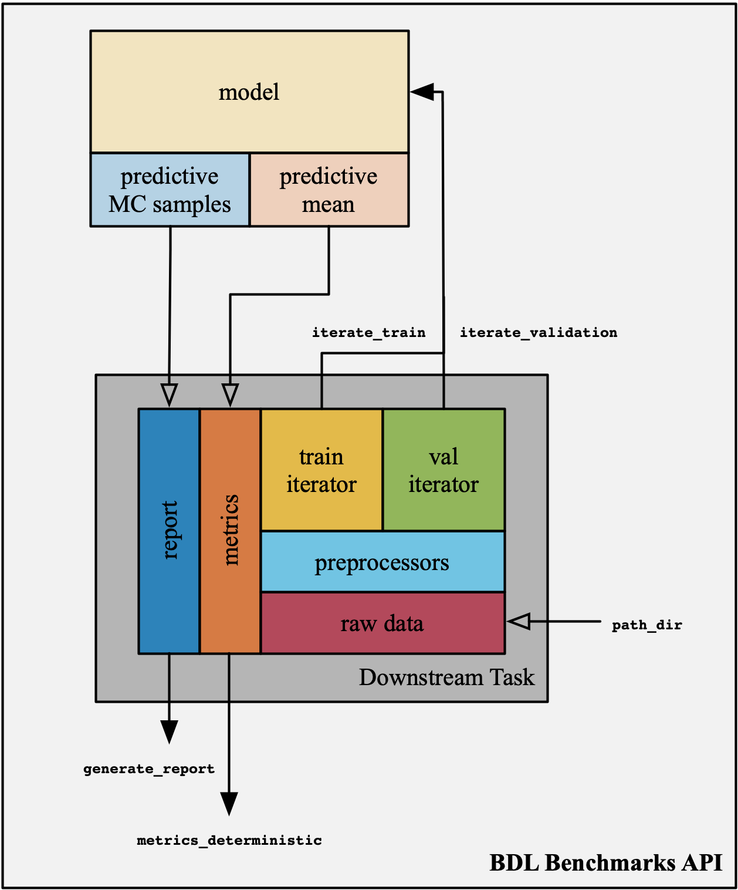

# API <a class="anchor" id="api"></a>

Each _benchmark_ consists of tasks and
baselines. The term _task_ is used to describe a fixed dataset.
The end-user solves the task by developing tools that respect
the constraints (e.g., time complexity, model size) and evaluation criteria
(i.e., domain knowledge specific metrics) posed by the task design.

## Task Levels <a class="anchor" id="task-levels"></a>

Each benchmark is given with three different tasks of increasing difficulty,
and within those tasks, each dataset is segmented into train, validation, and test
sets. The intention behind the diversity of tasks is to support
rapid iteration and a natural progression in complexity as research
projects progress. We provide some guidelines for how each task
should be used, as well as the expected run time
for training a model -- of suitable complexity -- to convergence on modern hardware.

* **Real-world**: The full dataset and input dimensionality. This version is
  intended for the evaluation of proposed techniques at a scale applicable
  to the real world. There are no guidelines for train time for
  the real-world version of the task, reflecting the fact that any improvement will
  translate to safer, more robust and reliable systems.
* **Medium**: Fewer examples and reduced input dimensionality. This version is intended
  for prototyping before moving on to the real-world scale data. Training
  on a single modern GPU should take five or six hours.
* **Toy**: Fewer examples and drastically reduced input dimensionality. This version
  is intended for sanity checks and debugging only. Training on
  a modern CPU should take five to ten minutes.

The user would usually start with the toy task to quickly assess different ideas and sanity-check their implementation. Note though that the toy task, as its name suggests, is not representative of real-world applications and researchers are expected to report results in publications on the medium and real-world tasks. Full guidelines (including expected resources and expected run time) are given in the [whitepaper](http://oatml.cs.ox.ac.uk/benchmarks/whitepaper.pdf).

## Architecture <a class="anchor" id="architecture"></a>

<p align="center">
  
</p>

A _task_ object consists of:

* **Raw Data**: The fixed dataset;
* **Pre-processors**: A set of data transformations, applied on the raw dataset;
* **Data Iterators**: Two lazy iterable containers, one for the training
  set and one for the validation set;
* **Metrics**: The set of task-specific quantifiable metrics, used for
  model selection and benchmarking;
* **TeX Report Generator**: Automatic TeX script generator with tables and
  figures relevant to the task.

For flexibility, whenever possible, data iterators are provided in pure
`NumPy`, allowing easy integration with any library. In cases where
data are too large to facilitate this, we provide optimized
`TensorFlow` [[19]](../docs/Citations.md#Abadi-2015) and `PyTorch` [[20]](../docs/Citations.md#Paszke-2017) data loaders
(i.e., lazy loading and hardware optimized). In BDL Benchmarks a task is initialized as follows:

```python
# e.g., benchmark_name=Diabetes, task_difficulty=Toy
dtask = bdlb.tasks.<benchmark_name><task_difficulty>(path_dir)
```

where `path_dir` the path to the stored raw data (the
data is not privately hosted in order to respect licensing,
hence it should be manually downloaded).

`NumPy` data iterators are accessed by:

```python
for x_train, y_train in dtask.iterate_train(batch_size):
  # Training loop

for x_val, y_val in dtask.iterate_validation(batch_size):
  # Validation loop
```

`PyTorch` datasets can be accessed via the `get_pytorch_datasets()` method:
```python
train_dataset, eval_dataset, test_dataset = dtask.get_pytorch_datasets()
```
Where they can be used to create normal PyTorch DataLoaders. For example:

```python
train_loader = torch.utils.data.DataLoader(
    train_dataset, batch_size=64, shuffle=True, num_workers=2, pin_memory=True)
```

Model tunning and hyperparameter calibration can be facilitated by
the task-specific metrics, used as follows:

```python
metrics = dtask.metrics_deterministic(labels, predictions)
```

After training and tuning on the validation set, we provide
a simple utility for each task that generates a set
of visualisations and metrics that can be placed in papers
and reports on the proposed techniques. These visualisations and metrics
are specific to the task at hand and are intended to
communicate features of the proposed technique to domain experts.
The TeX report is generated by:

```python
def estimate(x):
    # Uncertainty estimator function
    ...
    return mean, std

# Generate report
report = dtask.generate_report(estimate)
report.to_latex(filename)
```

We highlight that the API is framework agnostic, since the
end-user is free to choose any deep learning framework, as
long as they provide a single `estimate` function (i.e., callable),
which accepts an input `x` and returns an estimate of the predictive
`mean` and `std`. Remember, of course, to ensure that `estimate` normalizes
and preprocesses `x` in a manner similar to that with which your model
was trained.
